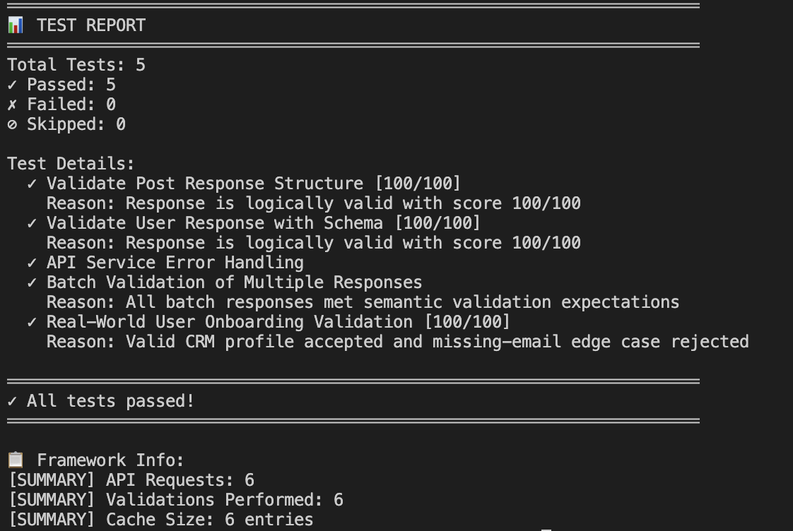

# AI-Powered Test Automation Framework

Production-aware AI API validation that combines deterministic checks with semantic LLM reasoning.


## ⚡ Quick Demo

```bash
npm test
```

```text
[TEST STEP] Running: Validate User Response with Schema
[AI VALIDATION]
Status : PASS
Reason : Response contains identity, contact, and company information.
[TEST RESULT]
Status : PASS
Score  : 100/100
Reason : Response contains identity, contact, and company information.

[TEST STEP] Running: Real-World User Onboarding Validation
[AI VALIDATION]
Status : PASS
Reason : User profile is ready for CRM onboarding.
[AI VALIDATION]
Status : FAIL
Reason : Missing required field(s): email

TEST REPORT
Total Tests: 5
Passed: 5
Failed: 0
All tests passed!
```

## 📸 Sample Execution



- Recommended stable filename for future updates: `/docs/sample-output.png`
- Keep logs/screenshots sanitized (no keys, no secrets, no sensitive payloads)

Command to capture fresh demo output:

```bash
npm run test:mock > docs/sample-output.txt
```

## Overview

Traditional API testing is excellent for status codes and exact schema checks, but it can miss whether data is logically valid for real workflows. This framework keeps deterministic controls and adds AI-assisted semantic validation to improve signal quality.

Current API under test:

```text
https://jsonplaceholder.typicode.com
```

## Key Capabilities

- AI-based semantic validation with normalized `PASS/FAIL` decisions.
- Schema-required field gate before semantic AI evaluation.
- Provider abstraction for Anthropic and OpenAI.
- Retry, timeout, and request-history controls.
- Validation caching for repeated response/expectation pairs.
- Mock AI mode for low-cost local and CI runs.

## Architecture

```text
ai-powered-test-automation/
├── .github/workflows/test.yml
├── config/
├── docs/
├── examples/real-world-scenario.js
├── prompts/validationPrompts.js
├── services/apiService.js
├── tests/
│   ├── ai-validation.test.js
│   └── unit/aiDecisionEngine.test.js
├── utils/
│   ├── aiDecisionEngine.js
│   ├── aiValidator.js
│   ├── llmFactory.js
│   └── logger.js
└── README.md
```

## Execution Flow

```text
npm test
  -> tests/ai-validation.test.js
  -> services/apiService.js
  -> utils/aiValidator.js
  -> utils/llmFactory.js
  -> utils/aiDecisionEngine.js
  -> [AI VALIDATION] / [TEST RESULT]
```

## 🛒 Real-World Scenario

User onboarding API validation for CRM readiness:

- Ensure required fields exist (`id`, `name`, `email`, `phone`, `address`, `company`)
- Validate logical consistency for identity/contact/company data
- Detect incomplete or invalid responses using AI + schema checks

The suite also removes `email` as an edge case and verifies rejection.

Integration scenario pack under `tests/integration/` validates realistic API concerns:

- Auth-required contract (`Authorization` header validation)
- Versioned API access (`X-API-Version`)
- Pagination behavior (`hasNextPage` and page transitions)
- Partial failure recovery (`503` followed by retry success)

## ⚖️ Traditional vs AI Testing

| Area | Traditional API Test | AI-Powered Validation |
| --- | --- | --- |
| Assertion style | Exact field/value checks | Semantic and business-intent checks |
| Maintenance | Brittle when harmless details change | Tolerant to acceptable variation |
| Signal | "Field exists" | "Response is logically valid for workflow" |
| Best use | Contracts and status codes | Data quality and readiness checks |
| Risk | Low ambiguity | Needs controls for nondeterminism |

## ⚙️ Configuration

Runtime config lives in `config/config.js`.

Primary controls:

- `LLM_PROVIDER`
- `USE_MOCK_AI`
- `API_BASE_URL`
- `API_TIMEOUT`
- `MAX_RETRIES`
- `RETRY_DELAY_MS`

Common commands:

```bash
npm install
cp .env.example .env
npm test
npm run test:mock
npm run test:unit
npm run test:integration
```

## 📈 Scalability

- Modular separation enables larger suites without tight coupling.
- Provider abstraction supports adding future LLM vendors.
- Prompt isolation supports domain-specific validation packs.
- CI workflow (`.github/workflows/test.yml`) enables repeatable PR checks.
- Reliability behavior is unit-tested for decision logic and HTTP retry/error paths.
- CI publishes machine-ingestible artifacts (`reports/unit-test-report.json`, `reports/integration-test-report.json`, `reports/mock-test-report.json`) for triage.

## ⚠️ Limitations & Mitigation

| Limitation | Mitigation |
| --- | --- |
| AI nondeterminism | Thresholding, explicit prompts, and deterministic schema gates |
| Rate limits and transient failures | Retries with backoff and controlled sequential batch execution |
| Real-model cost | Mock AI mode for PR/smoke runs |
| External API dependency | Timeouts, retries, and clear failure reporting |

## 🎯 Key Takeaway

This project demonstrates practical AI testing: deterministic controls first, AI reasoning second. The result is stronger validation quality with explicit production safeguards for reliability, cost, and operational clarity.

## 🧩 System Design Thinking

- Separation of concerns across tests, services, utils, and config.
- AI decision layer abstraction independent from API execution layer.
- Config-driven execution for provider/mode/runtime behavior.
- Extensibility path for multiple LLM providers without test rewrite.

## ⚙️ Engineering Decisions

- Schema-first, AI-second: fail fast on contract integrity before semantic scoring.
- Sequential batch processing: reduce provider throttling risk and keep cost predictable.
- Mock AI in PR workflows: preserve feedback speed and budget while keeping real-model validation optional.
- Provider abstraction in `llmFactory.js`: isolate model vendor changes from test authoring.
- Integration scenario pack: validate enterprise API behavior (auth/versioning/pagination/recovery) without coupling to paid external systems.

## 🧠 Author Note

This project reflects my approach to modern QA: moving from rule-based validation to intelligent, AI-assisted testing systems.

## License

MIT
